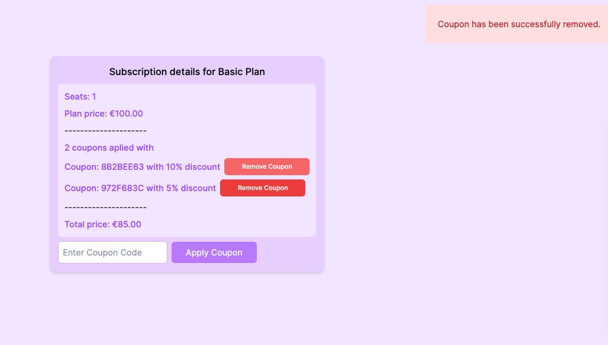

# Subscription Coupon Discount System

This project implements a **subscription-based system** where users can subscribe to different plans and apply discount coupons. The system ensures proper **coupon usage tracking, prevents race conditions**, and updates pricing both in the application and an external payment provider.

## Features

- **Subscription Management**: Users can subscribe to different plans.
- **Coupon Discounts**: Apply percentage-based discount coupons to subscriptions.
- **Stacking Coupons**: Multiple coupons can be applied to a single subscription.
- **Background Processing**: Uses Sidekiq to notify the external payment provider asynchronously.
- **Coupon Removal**: Removing a coupon restores the subscription price.

## [Video Link](https://www.loom.com/share/4ca80355d94a43f88d33bcf054c89130)

## Project Image


## Setup Instructions

### **Prerequisites**
- Ruby `3.2.2`
- Rails `7.1`
- PostgreSQL
- Redis (for Sidekiq)

### **Installation**
```
git clone https://github.com/PolinaStamenova/subscription-coupon-discounts.git
```
```
cd your-project-directory
```
```
bundle install
```
```
rails db:setup
```

### **Run the app locally**
```
bin/dev
```

### **Testing**

To run tests:
```
rspec spec/
```

### **Future Improvements**

- **Implement authentication and authorization (Admin Panel)**

  Adding authentication will allow user-specific experiences, and an admin panel will help manage plans, subscriptions, and coupons securely.

- **Use View Components for reusable and maintainable UI**

  View Components will improve consistency in UI design, reduce duplication, and speed up styling and future UI changes.

- **Introduce coupon expiration logic**

  Currently, coupons do not have expiration dates. Adding this feature will prevent the long-term use of discount codes.

- **Enhance UI/UX for better usability**

  Improve the user interface and overall user experience, ensuring smooth interactions and clarity in applying and removing coupons.

- **Ensure full responsiveness for all screen sizes**

  Adapting the UI to different devices will provide a better experience for users on mobile, tablets, and desktops.

## Author

👤 **Polina Stamenova**

- GitHub: [@githubhandle](https://github.com/PolinaStamenova)
- LinkedIn: [LinkedIn](https://www.linkedin.com/in/polina-stamenova-a60766112/)

## 🤝 Contributing

Contributions, issues, and feature requests are welcome!

Feel free to check the [issues page](https://github.com/PolinaStamenova/subscription-coupon-discounts/issues).

## Show your support

Give a ⭐️ if you like this project!

## Acknowledgments

[Saas.group](https://saas.group/) & [Tower](https://www.git-tower.com/mac)
